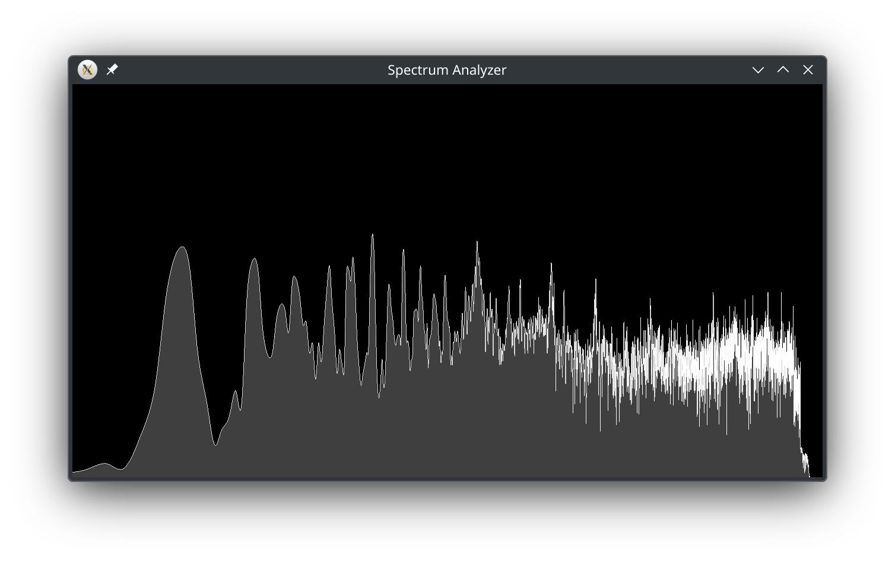

### Build

You need make, sfml and fftw, on Arch Linux:

```bash
sudo pacman -S make sfml fftw
```

Then:

```bash
git clone https://github.com/Fyde0/spectrum-analyzer
cd spectrum-analyzer
make
```

### Usage

Run it:

```bash
./analyzer
```

#### Controls:

| Action                                   | Key           |
| ---------------------------------------- | ------------- |
| Cycle input devices                      | Tab           |
| Toggle fill                              | F             |
| Switch mode (spectrum/oscilloscope)      | M             |
| Oscilloscope horizontal zoom (looks bad) | Right, Left   |
| Oscilloscope vertical zoom               | Up, Down      |
| FPS limit +/- 30 (higher CPU usage)      | Period, Comma |
